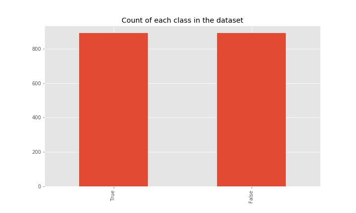
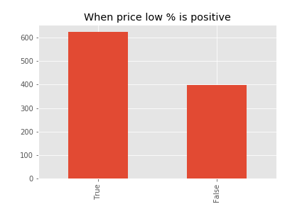
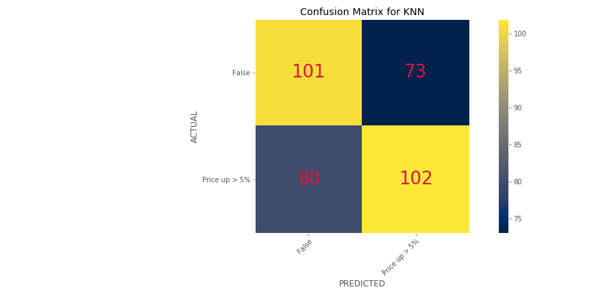

# Stock Predictor
#### Predicting if a stock will rise by 5% or more in its next quarter based on fundamental data
Marco Santos

## Table of Contents
  * [Data](#Data)
  * [Data Exploration](#Exploring-the-Dataset)
  * [Modeling](#Modeling)
  * [Results/Recommendations](#Results)
  * [Improvements](#Potential)
  * [Conclusion](#Conclusion)
  
### Tools Used:
* Scikit Learn
* Matplotlib
* Pandas
* BeatifulSoup

## Data

The main source of data was retrieved from [Stockpup.com](http://www.stockpup.com/data/).
  * Data was downloaded from 765 different csv files.
  * Webscraping was implemented in order to automate the download process: [Retrieving Data](Retrieving_Data.ipynb).
  * Each csv file was saved as a separate Pandas DataFrame and stored in a dictionary which was pickled for later use.
  
### [Data Formatting, Cleaning, and Organizing](Cleaning_Original_Data.ipynb)

Throughout most of the process, until all the Pandas DataFrames were combined, many functions were applied by iterating through the dictionary storing each stock's unique dataframe.

__Cleaning/Formatting the Data__:
1. Index of the DataFrame was set to the dates.
2. All values containing the word "None" and the value "0" were replaced with NaN.
3. All values were then converted to numeric values.
4. NaN were then filled using `bfill()`.  This was done so the last reported values become the most recent. Future NaNs remained.
5. Functions were written to create a new column containing whether or not the price increased by >5% in the upcoming quarter and to create new features showing the percent increase/decrease from previous quarters.
6. First and last rows were removed.  The first row could not contain the information on the stock's future movement and the last row had no data in the past to compare.
7. Finally, all DataFrames in the dictionary were combined into one large DataFrame.

__Final DataFrame__:
1. All NaN values were removed.
2. Remaining values were multiplied by 100 and rounded to two decimal places.
3. Columns/features containing less than 500 unique values were removed because they did not contain enough information.
4. True and False classes were then balanced so they both had equal representation in the DataFrame.
5. The complete and clean DataFrame was exported by pickling for later.

Below is a visualization of the class balance in the dataset:

Jupyter notebook containing the code for this entire process: [Cleaning_Original_Data](Cleaning_Original_Data.ipynb)

## Exploring the DataSet

With the final dataframe ready, the Data was then analyzed for better comprehension.

Each feature was plotted to see any class dominance when that specific feature was selected.

Example: 

Features correlation was observed using a heatmap to check if any specific features were significantly correlated.

Jupyter notebook containing this process: [Exploring_Data](Exploring_Data.ipynb)

## Modeling
### Models Used:
* Logistic Regression
* K Nearest Neighbors
* Decision Tree
* Random Forest
* XGBoost

Each model implemented optimized parameters using _GridSearchCV_.

#### Baseline Model:
Dummy Classifier was used as a baseline model. (Used in this notebook: [Modeling_baseline](Modeling_baseline.ipynb))

The results from runnning the Dummy Classifier on the final dataframe:
* Accuracy Score: 46%
* F1 Score: 46%

Dummy Classifier's Confusion Matrix:

#### Logistic Regression:
Results:
* Accuracy Score: 56%
* F1 Score: 60%

Confusion Matrix for

#### K Nearest Neighbors:
Results:
* Accuracy Score: 57%
* F1 Score: 57%

Confusion Matrix for KNN:

#### Decision Tree:
Results:
* Accuracy Score: 59%
* F1 Score: 67%

Confusion Matrix for Decision Tree:

#### Random Forest:
Results:
* Accuracy Score: 58% - 62%
* F1 Score: 62% - 67%

Confusion Matrix for Random Forest:

#### XGBoost:
Results:
* Accuracy Score: 61%
* F1 Score: 63%

Confusion Matrix for XGBoost:

__Notebooks containing each model:__
* [Decision Tree and Logistic Regression](Modeling_DecTree_LogReg.ipynb)
* [KNearestNeighbors](Modeling_KNN.ipynb)
* [RandomForest and XGBoost](Modeling_RF_XGBoost.ipynb) 

## Results/Recommendations
When it comes to selecting which model performed best, there is only one clear answer: XGBoost.  This is due to the fact that XGBoost is the most consistent of the models along with its high score. Random Forest may have performed better but its results were inconsistent.

However, Random Forest was correct more often than not, so for those people searching for more opportunities in investing, Random Forest may be the preferred model. Others who are not so concerned with quantity may perhaps choose XGBoost because of its consistency and stability.

__Important Features__
When it comes to selecting which features were most important in determing whether a stock will go increase by >5%, XGBoost and RandomForest had similar observations:

Random Forest's Important Features:

XGBoost's Important Features:

For both, _price low_ appears to be very important when determining stock movement in the next quarter.  This means that if the lowest price of the last quarter increased in the current quarter, then the stock has great chance for a 5% move in the next quarter.

## Potential Improvements
* _Feature interactions_ could be included to better understand the fundamental data and how it affects price.
* Eliminate certain features. Potentially principle component analysis could be used to reduce the number of unimportant features.
* More sources. Other data sources could have been used to fill in missing values.
* Run more models. More models such as Naive Bayes and SVM could have been ran to compare their results to the current models.

## Conclusion
Stocks fundamental data plays a large role in determining the underlying price.  The fact that the models here performed better than the baseline by more than 10% shows a strong validation for fundamental analysis as a stock investing technique.  XGBoost and RandomForest seem to be enough for now but more models and anaylses could have been done in order to improve the overall results.  The overall results here are mostly positive and appear to pointing in the right direction.
